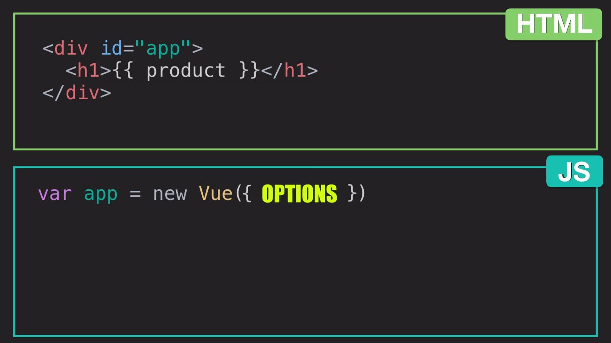
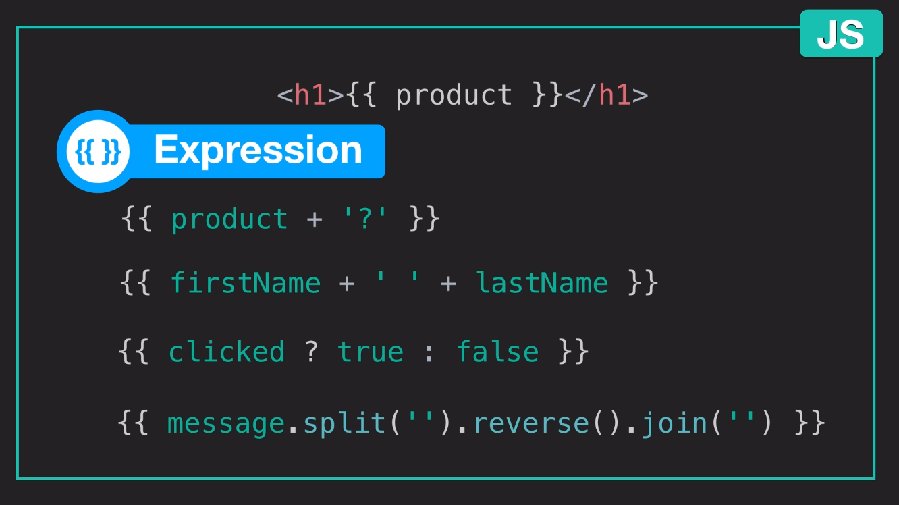

# vue-mastery

# Notes

---
the following images are screenshots taken from course videos
### Options


### Plugging in data


### Expressions



## Shortcuts

Because of the popularity of certain directives, there has been an effort to use shorthand for ease-of-use.

### v-bind:

- `:alt="description"`
- `:href="url"`
- `:title="toolTip"`
- `:class="isActive"`
- `:style="isStyled"`
- `:disabled="isDisabled"`

### v-on:

- @click
	- `<button @click="addToCart">Add to Cart</button>`
- @mouseover
	- `<div @mouseover="updateProduct">Color</div>`
- @submit
	- `<form @submit="addToCart">...</form>`
- @keyup
	- `<input @keyup.enter="send">`

---

## Use `:key` when using `v-for`

e.g. `<div v-for="variant in variants" :key="variant.variantId">`

---

Expression examples

 * `{{ product + '?' }}`
 * `{{ firstName + ' ' + lastName }}`
 * `{{ clicked ? true : false }}`
 * `{{ message.split('').reverse().join('') }}`

---

## The Vue Instance

Throughout this course you will learn the fundamentals of Vue while we build this product page together.


## Prerequisites:
This course assumes a foundational knowledge in HTML, CSS and JavaScript.

## Our Goal
In this lesson, we’ll show you how to use Vue to display data onto a webpage.

** See instructions below linked videos
### [5. Event Handling](https://www.vuemastery.com/courses/intro-to-vue-js/event-handling)

---

### [6. Class and Style Binding](https://www.vuemastery.com/courses/intro-to-vue-js/class-&-style-binding)

html
```
<h1 :style="{ color: color }">...</h1>
```

js
```
data: {
	color: 'red'
}
```

If you prefer, you can use kebab-case for CSS properties instead of camelCase but you must use it as a string (with quotes)

e.g. `'background-color'` vs. `backgroundColor`

---
---
**`idea`:** use / improve this product app for rackbusters feature branch


<!-- 1. <a href="https://wakatime.com"></a> -->

<!-- 2. <a href="https://wakatime.com"></a> -->